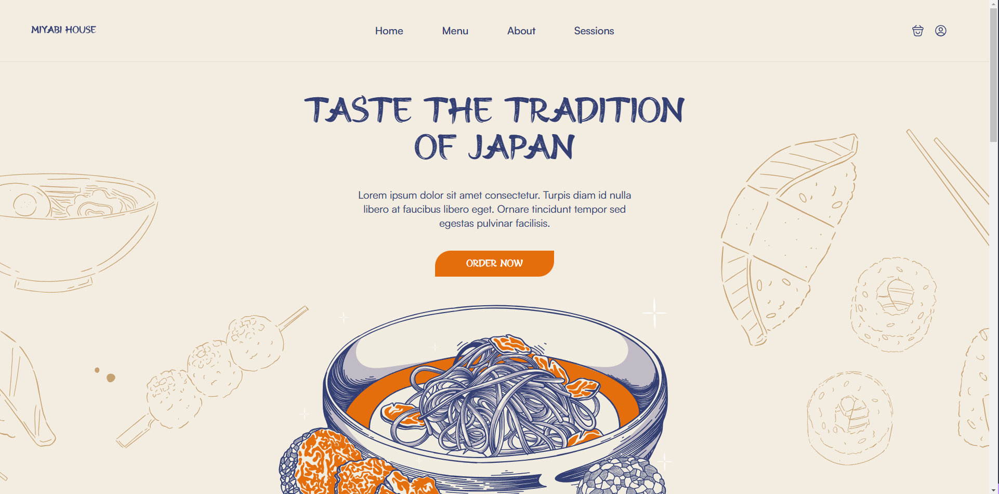
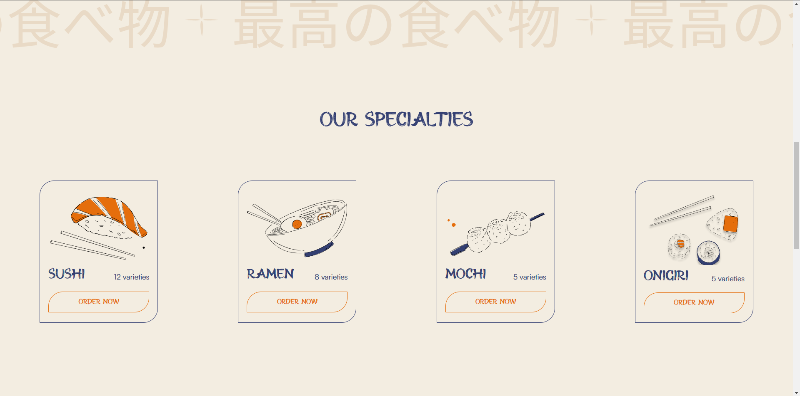

# Traditional Japanese Food Landing Page

This project is a landing page for a traditional Japanese food website. It's designed to showcase the rich and diverse culinary culture of Japan.

## Screenshots

Here are some screenshots of the landing page:

## Features

- Beautiful, clean design
- Best practices in web development
- Showcases a variety of traditional Japanese dishes

## How to Use

To use this landing page, simply clone the repository and open `index.html` in your web browser.
